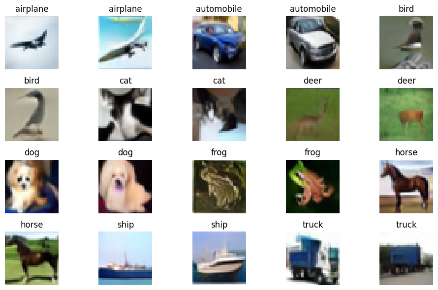

# flow_matching_models
A from-scratch implementation of flow-matching models for conditional image generation.

PyTorch implementation of conditional flow matching (CFM) models for image generation. Implements classifier-free guidance, different ODE solvers, FID metric, and mixed-precision training. Developed on a Dell XPS 14 laptop with Intel Panther Lake X7 SoC, 64GB RAM, Windows-11.

## Description

This project implements **conditional flow matching** — a modern generative modeling framework that learns deterministic vector fields to map a noise distribution (typically Gaussian at t=0) to the data distribution (at t=1). Unlike diffusion models that require solving SDEs, CFM directly optimizes an ODE whose solution at t=1 samples from the target distribution.

Implementation details:
- **Class conditioned** flow-matching models for image generation. Can use any image classification dataset to train a class-label conditioned image generation model
- **Conditional Flow Matching Loss** with classifier-free guidance training via class label dropout
- **UNet Arch** (`m000_unet.py`) with sinusoidal timestep embeddings, AdaGN conditioning
- **Mixed-precision training** via `torch.autocast` with `bfloat16` dtype
- **Learning rate warmup + cosine decay** learning rate schedule
- **TensorBoard logging** for loss curves and sample images

\
Generated samples for `CIFAR10`, `200k_Train_Iters` ([TB Screenshot](checkpoints/exp_001/TB_Screenshot.png)), `CFG_Scale = 4.0`, `DPMP_Solver`, `20_Sampling-steps`: 

 

Check [`jupyter_notebooks\cifar10_fm_unet_vis.ipynb`](jupyter_notebooks\cifar10_fm_unet_vis.ipynb) for more samples & FID metrics from different ODE solvers.

## Setup

### Prerequisites

- Python >= 3.11
- PyTorch
- Numpy
- Scikit-Learn
- PyYAML
- TensorBoard

[Setup instructions](https://docs.pytorch.org/docs/2.12/notes/get_start_xpu.html) for PyTorch on Intel GPU. Rest of the packages installed via `pip install`.

### Configuration

See `config/config_001.yml` for config structure.


## Running Training

### Train a class conditioned Flow-Matching Model

```bash
python train.py --config path/to/config.yml --ckpt_dir ./checkpoints/exp_dir
```

This will:
1. Build the model
2. Set up data loaders, optimizer (AdamW), and LR scheduler
3. Start training. Logs to TensorBoard & stdout.
4. Run validation (loss + FID) and save checkpoints every `val_iters`
5. Generate sample images & log them to TensorBoard during each validation run

## Project Structure

| File | Description |
|------|-------------|
| `utils/flow_matching_utils.py` | Time samplers, CFM loss computation, ODE solvers (Euler, DPM-Solver++) |
| `models/m000_unet.py` | UNet with skip connections, AdaGN conditioning and classifier-free guidance support |
| `lib/train_lib.py` | Trainer class — handles training loop, validation, checkpointing, FID computation |
| `train.py` | Training script |

## TODO

- [ ] Add more data augmentations
- [ ] Add Exponential Moving Average
- [ ] Add transformer architecture
- [ ] Add more ODE solvers
- [ ] Real-world dataset configs (eg: ImageNet)

